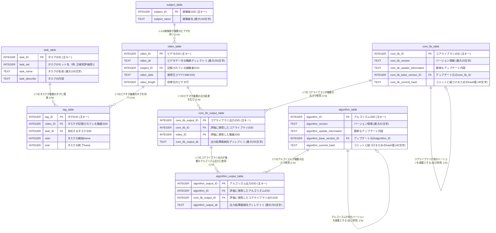

# データベース仕様書: タスク管理およびビデオ処理システム（SQLite3／更新タイミング反映版）

## 1. 概要
本仕様書は、ビデオデータに基づくタスクのタグ付け、コアライブラリとメインアルゴリズムのバージョン管理（自己参照を含む）、およびそれらの出力結果を管理するためのデータベース設計を定義します。`00_design/ref_design_byGrok4_2.md` を基に、各テーブルの更新・作成タイミングを明確化しました。

- **対象システム**: ビデオ処理および評価システム
- **データベース**: SQLite3（軽量、組み込み型、サーバーレス）
- **バージョン管理**: コアライブラリ／アルゴリズムは文字列バージョン（例: `1.0.0`）とGitコミットハッシュ（SHA-1, 40文字）で識別
- **関係性**: 外部キー（FK）で連結。`core_lib_table` と `algorithm_table` は自己参照（1:N）
- **日付**: 2025-08-19（本仕様書作成）
- **SQLite3特記事項**:
  - 外部キー制約は `PRAGMA foreign_keys = ON;` で有効化
  - データ型は動的だが、本仕様では明示（`INTEGER` / `TEXT`）
  - 主キーは `INTEGER PRIMARY KEY AUTOINCREMENT`

## 2. 更新・作成タイミング（ライフサイクル）
各テーブルのレコードが作成・更新されるタイミングは次のとおりです。

1. `task_table`, `subject_table` : データ収集準備段階
2. `video_table`, `tag_table` : データ収集後
3. `core_lib_table` : コアライブラリのバージョン更新時
4. `core_lib_output_table` : コアライブラリの評価実施時（基本的にはコアライブラリ更新時に自動実行）
5. `algorithm_table` : メインアルゴリズムのバージョン更新時
6. `algorithm_output_table` : メインアルゴリズムの評価実施時（基本的にはメインアルゴリズム更新時に自動実行）

補足:
- `core_lib_output_table.core_lib_output_dir` はコアライブラリの評価結果格納先（例: `02_core_lib_output/` 配下）を指します。
- `algorithm_output_table.algorithm_output_dir` はアルゴリズム評価結果格納先（例: `03_algorithm_output/` 配下）を指します。

## 3. ER図（Mermaid）
以下はER図です。Mermaid Live Editor（`https://mermaid.live/`）で可視化してください。



## 4. テーブル定義（推奨データ型・制約）
SQLite3では動的型付けですが、本仕様では以下の通り明示します。

### task_table
- 目的: タスクの情報管理
- 属性:
  - `task_ID INTEGER`（PK, AUTOINCREMENT）
  - `task_set INTEGER`（例: 評価セット番号）
  - `task_name TEXT`（最大100）
  - `task_describe TEXT`

### subject_table
- 目的: 被験者情報管理
- 属性:
  - `subject_ID INTEGER`（PK, AUTOINCREMENT）
  - `subject_name TEXT`（最大100）

### video_table
- 目的: ビデオメタデータ管理
- 属性:
  - `video_ID INTEGER`（PK, AUTOINCREMENT）
  - `video_dir TEXT`（最大255）
  - `subject_ID INTEGER`（FK -> `subject_table.subject_ID`）
  - `video_date TEXT`（YYYY-MM-DD）
  - `video_length INTEGER`（秒）

### tag_table
- 目的: ビデオ内タスク区間のタグ付け
- 属性:
  - `tag_ID INTEGER`（PK, AUTOINCREMENT）
  - `video_ID INTEGER`（FK -> `video_table.video_ID`）
  - `task_ID INTEGER`（FK -> `task_table.task_ID`）
  - `start INTEGER`（開始フレーム）
  - `end INTEGER`（終了フレーム）

### core_lib_table
- 目的: コアライブラリのバージョン管理（自己参照で履歴）
- 属性:
  - `core_lib_ID INTEGER`（PK, AUTOINCREMENT）
  - `core_lib_version TEXT`（最大20, 例: 1.0.0）
  - `core_lib_update_information TEXT`
  - `core_lib_base_version_ID INTEGER`（FK -> 自己参照）
  - `core_lib_commit_hash TEXT UNIQUE`（SHA-1, 40）

### core_lib_output_table
- 目的: コアライブラリの評価出力管理
- 属性:
  - `core_lib_output_ID INTEGER`（PK, AUTOINCREMENT）
  - `core_lib_ID INTEGER`（FK -> `core_lib_table.core_lib_ID`）
  - `video_ID INTEGER`（FK -> `video_table.video_ID`）
  - `core_lib_output_dir TEXT`（最大255）

### algorithm_table
- 目的: メインアルゴリズムのバージョン管理（自己参照で履歴）
- 属性:
  - `algorithm_ID INTEGER`（PK, AUTOINCREMENT）
  - `algorithm_version TEXT`（最大20, 例: 2.1.0）
  - `algorithm_update_information TEXT`
  - `algorithm_base_version_ID INTEGER`（FK -> 自己参照）
  - `algorithm_commit_hash TEXT UNIQUE`（SHA-1, 40）

### algorithm_output_table
- 目的: メインアルゴリズムの評価出力管理
- 属性:
  - `algorithm_output_ID INTEGER`（PK, AUTOINCREMENT）
  - `algorithm_ID INTEGER`（FK -> `algorithm_table.algorithm_ID`）
  - `core_lib_output_ID INTEGER`（FK -> `core_lib_output_table.core_lib_output_ID`）
  - `algorithm_output_dir TEXT`（最大255）

## 5. SQLite3用スキーマ例
アプリケーション起動時に `PRAGMA foreign_keys = ON;` を実行してください。

```sql
-- 外部キー有効化
PRAGMA foreign_keys = ON;

-- task_table
CREATE TABLE task_table (
    task_ID INTEGER PRIMARY KEY AUTOINCREMENT,
    task_set INTEGER,
    task_name TEXT,
    task_describe TEXT
);

-- subject_table
CREATE TABLE subject_table (
    subject_ID INTEGER PRIMARY KEY AUTOINCREMENT,
    subject_name TEXT
);

-- video_table
CREATE TABLE video_table (
    video_ID INTEGER PRIMARY KEY AUTOINCREMENT,
    video_dir TEXT,
    subject_ID INTEGER,
    video_date TEXT,
    video_length INTEGER,
    FOREIGN KEY (subject_ID) REFERENCES subject_table(subject_ID) ON DELETE RESTRICT
);

-- tag_table
CREATE TABLE tag_table (
    tag_ID INTEGER PRIMARY KEY AUTOINCREMENT,
    video_ID INTEGER,
    task_ID INTEGER,
    start INTEGER,
    end INTEGER,
    FOREIGN KEY (video_ID) REFERENCES video_table(video_ID) ON DELETE RESTRICT,
    FOREIGN KEY (task_ID) REFERENCES task_table(task_ID) ON DELETE RESTRICT
);

-- core_lib_table
CREATE TABLE core_lib_table (
    core_lib_ID INTEGER PRIMARY KEY AUTOINCREMENT,
    core_lib_version TEXT,
    core_lib_update_information TEXT,
    core_lib_base_version_ID INTEGER,
    core_lib_commit_hash TEXT UNIQUE,
    FOREIGN KEY (core_lib_base_version_ID) REFERENCES core_lib_table(core_lib_ID) ON DELETE SET NULL
);

-- core_lib_output_table
CREATE TABLE core_lib_output_table (
    core_lib_output_ID INTEGER PRIMARY KEY AUTOINCREMENT,
    core_lib_ID INTEGER,
    video_ID INTEGER,
    core_lib_output_dir TEXT,
    FOREIGN KEY (core_lib_ID) REFERENCES core_lib_table(core_lib_ID) ON DELETE RESTRICT,
    FOREIGN KEY (video_ID) REFERENCES video_table(video_ID) ON DELETE RESTRICT
);

-- algorithm_table
CREATE TABLE algorithm_table (
    algorithm_ID INTEGER PRIMARY KEY AUTOINCREMENT,
    algorithm_version TEXT,
    algorithm_update_information TEXT,
    algorithm_base_version_ID INTEGER,
    algorithm_commit_hash TEXT UNIQUE,
    FOREIGN KEY (algorithm_base_version_ID) REFERENCES algorithm_table(algorithm_ID) ON DELETE SET NULL
);

-- algorithm_output_table
CREATE TABLE algorithm_output_table (
    algorithm_output_ID INTEGER PRIMARY KEY AUTOINCREMENT,
    algorithm_ID INTEGER,
    core_lib_output_ID INTEGER,
    algorithm_output_dir TEXT,
    FOREIGN KEY (algorithm_ID) REFERENCES algorithm_table(algorithm_ID) ON DELETE RESTRICT,
    FOREIGN KEY (core_lib_output_ID) REFERENCES core_lib_output_table(core_lib_output_ID) ON DELETE RESTRICT
);

-- 推奨インデックス
CREATE INDEX idx_core_lib_version ON core_lib_table(core_lib_version);
CREATE INDEX idx_algorithm_version ON algorithm_table(algorithm_version);
```

## 6. データ投入フロー（タイミング反映）
1. 準備段階: `task_table` 登録 → `subject_table` 登録
2. 収集後: `video_table` 登録（被験者とビデオの関連） → `tag_table` 登録（ビデオとタスク区間の関連）
3. コア更新: `core_lib_table` に新バージョンを登録
4. コア評価: `core_lib_output_table` に評価実行結果を登録（自動実行が基本）
5. アルゴ更新: `algorithm_table` に新バージョンを登録
6. アルゴ評価: `algorithm_output_table` に評価実行結果を登録（自動実行が基本）

## 7. ディレクトリとの対応（参考）
- `02_core_lib_output/` ↔ `core_lib_output_table.core_lib_output_dir`
- `03_algorithm_output/` ↔ `algorithm_output_table.algorithm_output_dir`

## 8. 運用・注意事項
- 外部キー制約を必ず有効化（`PRAGMA foreign_keys = ON;`）
- フレーム区間はアプリ層で `start < end` を検証
- バージョン文字列・コミットハッシュの一意性を維持（`UNIQUE`）
- 大量データ時はインデックスを追加しクエリ最適化

## 9. 簡易クエリ例
```sql
-- ビデオのタグを取得
SELECT t.*, v.video_dir, tk.task_name
FROM tag_table t
JOIN video_table v ON t.video_ID = v.video_ID
JOIN task_table tk ON t.task_ID = tk.task_ID;
```

---
本仕様は `ref_design_byGrok4_2.md` の最終版を踏襲しつつ、実運用に即した更新・作成タイミングを明記したものです。追加要件があれば追補します。


