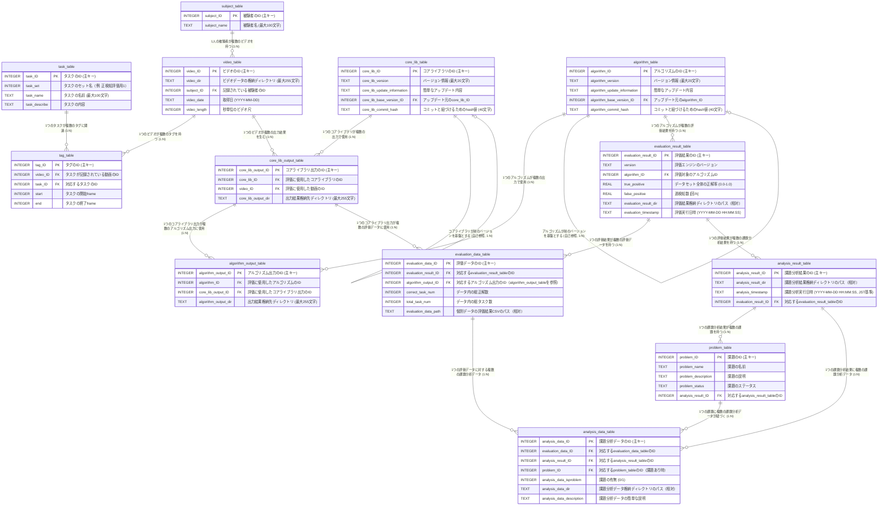

# データベース仕様書: タスク管理およびビデオ処理システム（SQLite3向け最終版）

## 1. 概要
この仕様書は、タスク、被験者、ビデオデータ、タグ、コアライブラリ、アルゴリズム、およびそれらの出力結果を管理するデータベースの設計を記述します。システムは、ビデオデータに基づくタスクのタグ付け、コアライブラリとアルゴリズムのバージョン管理（自己参照を含む）、および出力結果の追跡を目的としています。

- **対象システム**: ビデオ処理および評価システム
- **データベース**: SQLite3（軽量、組み込み型、サーバーレス）
- **バージョン管理**: コアライブラリとアルゴリズムのバージョンは文字列形式（例: `1.0.0`）で管理。コミットハッシュはGitのSHA-1（40文字）で特定。
- **関係性**: 外部キー（FK）によりエンティティを連結。`core_lib_table`と`algorithm_table`は自己参照。
- **日付**: 2025年8月18日（最終改訂）
- **SQLite3特記事項**:
  - 外部キー制約は`PRAGMA foreign_keys = ON;`で有効化。
  - データ型は動的だが、仕様書では明示（例: `VARCHAR(100)` → `TEXT`）。
  - 主キーは`INTEGER PRIMARY KEY AUTOINCREMENT`で自動増分。

この仕様書には、ER図（Mermaid記法）、テーブル詳細、関係性、データ型推奨、SQLite3用SQLスキーマ例を含めます。

## 2. ER図
以下は、Mermaid記法によるER図です。SQLite3のデータ型（`TEXT`など）に合わせて記述し、[Mermaid Live Editor](https://mermaid.live/)で視覚化してください。最新バージョンのMermaid（v10.9.0以降）を使用することでレンダリングエラーを回避できます。



### ER図の説明
- **エンティティ**: 各テーブルをボックスで表現。アトリビュートはSQLite3のデータ型（`INTEGER`, `TEXT`）と説明付き。
- **関係性**: 外部キー（FK）に基づく1:N関係を`||--o{`で、自己参照を`||--o|`で表現。ラベルで意味を明確化。
- **主キー (PK)**: 各テーブルの`ID`を`INTEGER PRIMARY KEY AUTOINCREMENT`で設定。
- **外部キー (FK)**: 関係性の基点。`core_lib_base_version_ID`（`core_lib_table`の自己参照）と`algorithm_base_version_ID`（`algorithm_table`の自己参照）を反映。
- **多対多関係**: `tag_table`が`video_table`と`task_table`を仲介。

## 3. テーブル詳細
各テーブルのアトリビュート、データ型、説明、制約を以下に示します。SQLite3ではデータ型は動的だが、仕様書では明示的に記述（例: `VARCHAR(100)` → `TEXT`、長さはドキュメント用）。

### task_table (タスクテーブル)
- **目的**: タスクの情報を管理。
- **アトリビュート**:
  | アトリビュート | データ型 | 説明 | 制約 |
  |----------------|----------|------|------|
  | task_ID | INTEGER | タスクのID | PK, AUTOINCREMENT |
  | task_set | INTEGER | タスクのセット名（例: 正検知評価用1） | - |
  | task_name | TEXT | タスクの名前（最大100文字） | - |
  | task_describe | TEXT | タスクの内容 | - |

### subject_table (被験者テーブル)
- **目的**: 被験者の情報を管理。
- **アトリビュート**:
  | アトリビュート | データ型 | 説明 | 制約 |
  |----------------|----------|------|------|
  | subject_ID | INTEGER | 被験者のID | PK, AUTOINCREMENT |
  | subject_name | TEXT | 被験者名（最大100文字） | - |

### video_table (ビデオテーブル)
- **目的**: ビデオデータのメタデータを管理。
- **アトリビュート**:
  | アトリビュート | データ型 | 説明 | 制約 |
  |----------------|----------|------|------|
  | video_ID | INTEGER | ビデオのID | PK, AUTOINCREMENT |
  | video_dir | TEXT | ビデオデータの格納ディレクトリ（最大255文字） | - |
  | subject_ID | INTEGER | 記録されている被験者のID | FK (subject_table.subject_ID) |
  | video_date | TEXT | 取得日（YYYY-MM-DD形式） | - |
  | video_length | INTEGER | 秒単位のビデオ尺 | - |

### tag_table (タグテーブル)
- **目的**: ビデオ内のタスク区間をタグ付け。
- **アトリビュート**:
  | アトリビュート | データ型 | 説明 | 制約 |
  |----------------|----------|------|------|
  | tag_ID | INTEGER | タグのID | PK, AUTOINCREMENT |
  | video_ID | INTEGER | タスクが記録されている動画のID | FK (video_table.video_ID) |
  | task_ID | INTEGER | 対応するタスクのID | FK (task_table.task_ID) |
  | start | INTEGER | タスクの開始frame | - |
  | end | INTEGER | タスクの終了frame | - |

### core_lib_table (コアライブラリテーブル)
- **目的**: コアライブラリのバージョンと更新情報を管理。自己参照でバージョン履歴を追跡。
- **アトリビュート**:
  | アトリビュート | データ型 | 説明 | 制約 |
  |----------------|----------|------|------|
  | core_lib_ID | INTEGER | コアライブラリのID | PK, AUTOINCREMENT |
  | core_lib_version | TEXT | バージョン情報（最大20文字、例: 1.0.0） | - |
  | core_lib_update_information | TEXT | 簡単なアップデート内容 | - |
  | core_lib_base_version_ID | INTEGER | アップデート元のcore_lib_ID | FK (core_lib_table.core_lib_ID, 自己参照) |
  | core_lib_commit_hash | TEXT | コミットと紐づけるためのhash値（40文字、SHA-1） | UNIQUE |

### core_lib_output_table (コアライブラリ出力テーブル)
- **目的**: コアライブラリの処理出力結果を管理。
- **アトリビュート**:
  | アトリビュート | データ型 | 説明 | 制約 |
  |----------------|----------|------|------|
  | core_lib_output_ID | INTEGER | 出力のID | PK, AUTOINCREMENT |
  | core_lib_ID | INTEGER | 評価に使用したコアライブラリのID | FK (core_lib_table.core_lib_ID) |
  | video_ID | INTEGER | 評価に使用した動画のID | FK (video_table.video_ID) |
  | core_lib_output_dir | TEXT | 出力結果格納先ディレクトリ（最大255文字） | - |

### algorithm_table (アルゴリズムテーブル)
- **目的**: アルゴリズムのバージョンと更新情報を管理。自己参照でバージョン履歴を追跡。
- **アトリビュート**:
  | アトリビュート | データ型 | 説明 | 制約 |
  |----------------|----------|------|------|
  | algorithm_ID | INTEGER | アルゴリズムのID | PK, AUTOINCREMENT |
  | algorithm_version | TEXT | バージョン情報（最大20文字、例: 2.1.0） | - |
  | algorithm_update_information | TEXT | 簡単なアップデート内容 | - |
  | algorithm_base_version_ID | INTEGER | アップデート元のalgorithm_ID | FK (algorithm_table.algorithm_ID, 自己参照) |
  | algorithm_commit_hash | TEXT | コミットと紐づけるためのhash値（40文字、SHA-1） | UNIQUE |

### algorithm_output_table (アルゴリズム出力テーブル)
- **目的**: アルゴリズムの処理出力結果を管理。
- **アトリビュート**:
  | アトリビュート | データ型 | 説明 | 制約 |
  |----------------|----------|------|------|
  | algorithm_output_ID | INTEGER | 出力のID | PK, AUTOINCREMENT |
  | algorithm_ID | INTEGER | 評価に使用したアルゴリズムのID | FK (algorithm_table.algorithm_ID) |
  | core_lib_output_ID | INTEGER | 評価に使用したコアライブラリ出力のID | FK (core_lib_output_table.core_lib_output_ID) |
  | algorithm_output_dir | TEXT | 出力結果格納先ディレクトリ（最大255文字） | - |

### evaluation_result_table (評価結果テーブル)
- **目的**: アルゴリズム評価の集計結果を管理。
- **アトリビュート**:
  | アトリビュート | データ型 | 説明 | 制約 |
  |----------------|----------|------|------|
  | evaluation_result_ID | INTEGER | 評価結果のID | PK, AUTOINCREMENT |
  | version | TEXT | 評価エンジンのバージョン | - |
  | algorithm_ID | INTEGER | 評価対象のアルゴリズムID | FK (algorithm_table.algorithm_ID) ON DELETE RESTRICT |
  | true_positive | REAL | データセット全体の正解率 (0.0〜1.0) | - |
  | false_positive | REAL | 1時間当たりの過検知数 [回/h] | - |
  | evaluation_result_dir | TEXT | 評価結果格納ディレクトリのパス（相対） | - |
  | evaluation_timestamp | TEXT | 評価実行日時（YYYY-MM-DD HH:MM:SS） | - |

### evaluation_data_table (評価データテーブル)
- **目的**: 各データ（例: 動画・区間）ごとの評価結果を管理。
- **アトリビュート**:
  | アトリビュート | データ型 | 説明 | 制約 |
  |----------------|----------|------|------|
  | evaluation_data_ID | INTEGER | 評価データのID | PK, AUTOINCREMENT |
  | evaluation_result_ID | INTEGER | 紐づく評価結果のID | FK (evaluation_result_table.evaluation_result_ID) ON DELETE RESTRICT |
  | algorithm_output_ID | INTEGER | 紐づくアルゴリズム出力のID | FK (algorithm_output_table.algorithm_output_ID) ON DELETE RESTRICT |
  | correct_task_num | INTEGER | データ内の総正解数 | CHECK (correct_task_num <= total_task_num) |
  | total_task_num | INTEGER | データ内の総タスク数 | - |
  | evaluation_data_path | TEXT | 個別データの評価結果CSVのパス（相対） | - |

注: 現時点では各フィールドのNOT NULL制約および追加インデックスは設定しません（将来拡張時に見直し）。

### analysis_result_table (課題分析結果テーブル)
- **目的**: 課題分析の1実行あたり1レコードを管理。
- **アトリビュート**:
  | アトリビュート | データ型 | 説明 | 制約 |
  |----------------|----------|------|------|
  | analysis_result_ID | INTEGER | 課題分析結果のID | PK, AUTOINCREMENT |
  | analysis_result_dir | TEXT | 課題分析結果格納ディレクトリのパス（相対） | - |
  | analysis_timestamp | TEXT | 課題分析実行日時（YYYY-MM-DD HH:MM:SS, JST基準） | - |
  | evaluation_result_ID | INTEGER | 紐づく評価結果のID | FK (evaluation_result_table.evaluation_result_ID) ON DELETE RESTRICT |

### problem_table (課題テーブル)
- **目的**: 課題分析で抽出された課題を管理。
- **アトリビュート**:
  | アトリビュート | データ型 | 説明 | 制約 |
  |----------------|----------|------|------|
  | problem_ID | INTEGER | 課題のID | PK, AUTOINCREMENT |
  | problem_name | TEXT | 課題の名前 | - |
  | problem_description | TEXT | 課題の説明 | - |
  | problem_status | TEXT | 課題のステータス | - |
  | analysis_result_ID | INTEGER | 紐づく課題分析結果のID | FK (analysis_result_table.analysis_result_ID) ON DELETE RESTRICT |

### analysis_data_table (課題分析データテーブル)
- **目的**: 各評価データに対して課題分析を実施した結果を管理。課題が無い場合は`analysis_data_isproblem=0`で`problem_ID=NULL`。
- **アトリビュート**:
  | アトリビュート | データ型 | 説明 | 制約 |
  |----------------|----------|------|------|
  | analysis_data_ID | INTEGER | 課題分析データのID | PK, AUTOINCREMENT |
  | evaluation_data_ID | INTEGER | 紐づく評価データのID | FK (evaluation_data_table.evaluation_data_ID) ON DELETE RESTRICT |
  | analysis_result_ID | INTEGER | 紐づく課題分析結果のID | FK (analysis_result_table.analysis_result_ID) ON DELETE RESTRICT |
  | problem_ID | INTEGER | 紐づく課題のID | FK (problem_table.problem_ID) ON DELETE RESTRICT |
  | analysis_data_isproblem | INTEGER | 課題の有無 (0/1) | CHECK相当はアプリ層で検証 |
  | analysis_data_dir | TEXT | 課題分析データ格納ディレクトリのパス（相対） | - |
  | analysis_data_description | TEXT | 課題分析データの簡単な説明 | - |

## 4. 関係性詳細
- **1:N関係**:
  - `subject_table` : `video_table` (1人の被験者が複数のビデオを持つ)。
  - `video_table` : `tag_table` (1つのビデオが複数のタグを持つ)。
  - `task_table` : `tag_table` (1つのタスクが複数のタグに関連)。
  - `video_table` : `core_lib_output_table` (1つのビデオが複数の出力結果を生む)。
  - `core_lib_table` : `core_lib_output_table` (1つのコアライブラリが複数の出力で使用)。
  - `algorithm_table` : `algorithm_output_table` (1つのアルゴリズムが複数の出力で使用)。
  - `core_lib_output_table` : `algorithm_output_table` (1つのコアライブラリ出力が複数のアルゴリズム出力に使用)。
  - `algorithm_table` : `evaluation_result_table` (1つのアルゴリズムが複数の評価結果を持つ)。
  - `evaluation_result_table` : `evaluation_data_table` (1つの評価結果が複数の評価データを持つ)。
  - `core_lib_output_table` : `evaluation_data_table` (1つのコアライブラリ出力が複数の評価データに使用)。
  - `evaluation_result_table` : `analysis_result_table` (1つの評価結果が複数の課題分析結果を持つ)。
  - `analysis_result_table` : `problem_table` (1つの課題分析結果が複数の課題を持つ)。
  - `evaluation_data_table` : `analysis_data_table` (1つの評価データが複数の課題分析データを持つ)。
  - `analysis_result_table` : `analysis_data_table` (1つの課題分析結果が複数の課題分析データを持つ)。
  - `problem_table` : `analysis_data_table` (1つの課題に複数の課題分析データが紐づく)。
- **自己参照 (1:N)**:
  - `core_lib_table` (`core_lib_base_version_ID`が`core_lib_ID`を参照)。
  - `algorithm_table` (`algorithm_base_version_ID`が`algorithm_ID`を参照)。
- **多対多関係**: `tag_table`が`video_table`と`task_table`を仲介。
- **整合性**: SQLite3ではFK制約を有効化（`PRAGMA foreign_keys = ON;`）し、`ON DELETE RESTRICT`で参照データの削除を防止。自己参照FKは`ON DELETE SET NULL`で安全性を確保。

## 5. データ型と制約の推奨
- **データ型選択の基準**:
  - SQLite3は動的型付けだが、仕様書では以下の型を明示：
    - 整数: `INTEGER`（例: ID、フレーム番号、秒数）。
    - 文字列（短い）: `TEXT`（例: `task_name`, 最大100文字）。
    - 文字列（長い）: `TEXT`（例: `task_describe`）。
    - パス: `TEXT`（例: `video_dir`, 最大255文字）。
    - バージョン: `TEXT`（例: `core_lib_version`, 最大20文字）。
    - コミットハッシュ: `TEXT`（例: `core_lib_commit_hash`, 40文字）。
    - 日付: `TEXT`（例: `video_date`, `YYYY-MM-DD`形式。SQLite3に専用型なし）。
- **追加制約**:
  - すべてのPK: `INTEGER PRIMARY KEY AUTOINCREMENT`。
  - コミットハッシュ: `UNIQUE`（衝突防止）。
  - バージョン: `INDEX`推奨（例: `CREATE INDEX idx_version ON core_lib_table(core_lib_version);`）。
  - フレーム (`start`, `end`): アプリ層で`start < end`を検証（SQLite3の`CHECK`制約は簡易）。
- **SQLite3特記事項**:
  - `VARCHAR(n)`は`TEXT`として扱われるが、仕様書では長さ（例: 100, 255）を明示。
  - 日付は`TEXT`（`YYYY-MM-DD`）で保存。必要なら`DATETIME`形式（例: `2025-08-18 15:22:00`）に変更。
  - FKは明示的に有効化が必要。

## 6. SQLスキーマ例 (SQLite3用)
以下は、SQLite3でテーブルを作成するSQL例です。データベースファイル（例: `video_task.db`）を作成後に実行してください。

```sql
-- 外部キー制約を有効化
PRAGMA foreign_keys = ON;

-- task_table
CREATE TABLE task_table (
    task_ID INTEGER PRIMARY KEY AUTOINCREMENT,
    task_set INTEGER,
    task_name TEXT,
    task_describe TEXT
);

-- subject_table
CREATE TABLE subject_table (
    subject_ID INTEGER PRIMARY KEY AUTOINCREMENT,
    subject_name TEXT
);

-- video_table
CREATE TABLE video_table (
    video_ID INTEGER PRIMARY KEY AUTOINCREMENT,
    video_dir TEXT,
    subject_ID INTEGER,
    video_date TEXT,
    video_length INTEGER,
    FOREIGN KEY (subject_ID) REFERENCES subject_table(subject_ID) ON DELETE RESTRICT
);

-- tag_table
CREATE TABLE tag_table (
    tag_ID INTEGER PRIMARY KEY AUTOINCREMENT,
    video_ID INTEGER,
    task_ID INTEGER,
    start INTEGER,
    end INTEGER,
    FOREIGN KEY (video_ID) REFERENCES video_table(video_ID) ON DELETE RESTRICT,
    FOREIGN KEY (task_ID) REFERENCES task_table(task_ID) ON DELETE RESTRICT
);

-- core_lib_table
CREATE TABLE core_lib_table (
    core_lib_ID INTEGER PRIMARY KEY AUTOINCREMENT,
    core_lib_version TEXT,
    core_lib_update_information TEXT,
    core_lib_base_version_ID INTEGER,
    core_lib_commit_hash TEXT UNIQUE,
    FOREIGN KEY (core_lib_base_version_ID) REFERENCES core_lib_table(core_lib_ID) ON DELETE SET NULL
);

-- core_lib_output_table
CREATE TABLE core_lib_output_table (
    core_lib_output_ID INTEGER PRIMARY KEY AUTOINCREMENT,
    core_lib_ID INTEGER,
    video_ID INTEGER,
    core_lib_output_dir TEXT,
    FOREIGN KEY (core_lib_ID) REFERENCES core_lib_table(core_lib_ID) ON DELETE RESTRICT,
    FOREIGN KEY (video_ID) REFERENCES video_table(video_ID) ON DELETE RESTRICT
);

-- algorithm_table
CREATE TABLE algorithm_table (
    algorithm_ID INTEGER PRIMARY KEY AUTOINCREMENT,
    algorithm_version TEXT,
    algorithm_update_information TEXT,
    algorithm_base_version_ID INTEGER,
    algorithm_commit_hash TEXT UNIQUE,
    FOREIGN KEY (algorithm_base_version_ID) REFERENCES algorithm_table(algorithm_ID) ON DELETE SET NULL
);

-- algorithm_output_table
CREATE TABLE algorithm_output_table (
    algorithm_output_ID INTEGER PRIMARY KEY AUTOINCREMENT,
    algorithm_ID INTEGER,
    core_lib_output_ID INTEGER,
    algorithm_output_dir TEXT,
    FOREIGN KEY (algorithm_ID) REFERENCES algorithm_table(algorithm_ID) ON DELETE RESTRICT,
    FOREIGN KEY (core_lib_output_ID) REFERENCES core_lib_output_table(core_lib_output_ID) ON DELETE RESTRICT
);

-- evaluation_result_table
CREATE TABLE evaluation_result_table (
    evaluation_result_ID INTEGER PRIMARY KEY AUTOINCREMENT,
    version TEXT,
    algorithm_ID INTEGER,
    true_positive REAL,
    false_positive REAL,
    evaluation_result_dir TEXT,
    evaluation_timestamp TEXT,
    FOREIGN KEY (algorithm_ID) REFERENCES algorithm_table(algorithm_ID) ON DELETE RESTRICT
);

-- evaluation_data_table
CREATE TABLE evaluation_data_table (
    evaluation_data_ID INTEGER PRIMARY KEY AUTOINCREMENT,
    evaluation_result_ID INTEGER,
    algorithm_output_ID INTEGER,
    correct_task_num INTEGER,
    total_task_num INTEGER,
    evaluation_data_path TEXT,
    FOREIGN KEY (evaluation_result_ID) REFERENCES evaluation_result_table(evaluation_result_ID) ON DELETE RESTRICT,
    FOREIGN KEY (algorithm_output_ID) REFERENCES algorithm_output_table(algorithm_output_ID) ON DELETE RESTRICT,
    CHECK (correct_task_num <= total_task_num)
);

-- analysis_result_table
CREATE TABLE analysis_result_table (
    analysis_result_ID INTEGER PRIMARY KEY AUTOINCREMENT,
    analysis_result_dir TEXT,
    analysis_timestamp TEXT,
    evaluation_result_ID INTEGER,
    FOREIGN KEY (evaluation_result_ID) REFERENCES evaluation_result_table(evaluation_result_ID) ON DELETE RESTRICT
);

-- problem_table
CREATE TABLE problem_table (
    problem_ID INTEGER PRIMARY KEY AUTOINCREMENT,
    problem_name TEXT,
    problem_description TEXT,
    problem_status TEXT,
    analysis_result_ID INTEGER,
    FOREIGN KEY (analysis_result_ID) REFERENCES analysis_result_table(analysis_result_ID) ON DELETE RESTRICT
);

-- analysis_data_table
CREATE TABLE analysis_data_table (
    analysis_data_ID INTEGER PRIMARY KEY AUTOINCREMENT,
    evaluation_data_ID INTEGER,
    analysis_result_ID INTEGER,
    problem_ID INTEGER,
    analysis_data_isproblem INTEGER,
    analysis_data_dir TEXT,
    analysis_data_description TEXT,
    FOREIGN KEY (evaluation_data_ID) REFERENCES evaluation_data_table(evaluation_data_ID) ON DELETE RESTRICT,
    FOREIGN KEY (analysis_result_ID) REFERENCES analysis_result_table(analysis_result_ID) ON DELETE RESTRICT,
    FOREIGN KEY (problem_ID) REFERENCES problem_table(problem_ID) ON DELETE RESTRICT
);

-- インデックス作成（オプション、検索高速化）
CREATE INDEX idx_core_lib_version ON core_lib_table(core_lib_version);
CREATE INDEX idx_algorithm_version ON algorithm_table(algorithm_version);
```

### SQLの説明
- **外部キー有効化**: `PRAGMA foreign_keys = ON;`をセッション開始時またはアプリ起動時に実行。
- **データ型**: SQLite3では`INTEGER`（整数）、`TEXT`（文字列）、`REAL`（浮動小数点）を使用。`VARCHAR(n)`は`TEXT`に統一し、長さはドキュメントで明示。
- **主キー**: `INTEGER PRIMARY KEY AUTOINCREMENT`で自動増分。
- **FK制約**: `ON DELETE RESTRICT`で参照データの削除を防止。自己参照FK（`core_lib_base_version_ID`, `algorithm_base_version_ID`）は`ON DELETE SET NULL`で安全性を確保。
- **インデックス**: バージョン検索を高速化するため、`core_lib_version`と`algorithm_version`にインデックスを推奨。
- **テスト例**:
  ```sql
  INSERT INTO task_table (task_set, task_name, task_describe) VALUES (1, 'Task1', 'Evaluate positive detection');
  INSERT INTO subject_table (subject_name) VALUES ('Subject A');
  INSERT INTO video_table (video_dir, subject_ID, video_date, video_length) VALUES ('/videos/subject_a.mp4', 1, '2025-08-18', 120);
  ```

## 7. 運用・メンテナンス
- **データ挿入フロー**:
  1. `subject_table` → `video_table` → `tag_table`（ビデオとタスクの関連付け）。
  2. `core_lib_table` → `core_lib_output_table`（ライブラリ出力）。
  3. `algorithm_table` → `algorithm_output_table`（アルゴリズム出力）。
- **クエリ例**:
  - ビデオのタグ取得:
    ```sql
    SELECT t.*, v.video_dir, tk.task_name
    FROM tag_table t
    JOIN video_table v ON t.video_ID = v.video_ID
    JOIN task_table tk ON t.task_ID = tk.task_ID;
    ```
  - 最新バージョンのコアライブラリ:
    ```sql
    SELECT * FROM core_lib_table
    WHERE core_lib_version = (SELECT MAX(core_lib_version) FROM core_lib_table);
    ```
- **バックアップ**: SQLite3は単一ファイル（例: `video_task.db`）なので、ファイルをコピー（`cp video_task.db backup.db`）。
- **セキュリティ**: 機密データ（例: `subject_name`）はアプリ層で暗号化。SQLite3はファイルアクセス制御で保護。
- **監査ログ**: 必要なら`audit_log`テーブルを追加（例: `CREATE TABLE audit_log (id INTEGER PRIMARY KEY AUTOINCREMENT, action TEXT, timestamp TEXT);`）。
- **SQLite3特記事項**:
  - トランザクション使用（`BEGIN TRANSACTION; ... COMMIT;`）でデータ整合性を確保。
  - 日付操作は`TEXT`形式でアプリ層で処理（例: `strftime`関数使用）。

## 8. 注意点
- **データ型**:
  - `task_set`: 数値（`INTEGER`）と仮定。文字列（例: `正検知評価用1`）の場合は`TEXT`に変更（例: `ALTER TABLE task_table MODIFY task_set TEXT;`）。
  - `video_date`: `TEXT`（`YYYY-MM-DD`）で保存。時間が必要なら`TEXT`で`YYYY-MM-DD HH:MM:SS`形式。
  - コミットハッシュ: SHA-1（40文字）を想定。SHA-256（64文字）の場合は`TEXT`（長さ64文字）に変更。
- **エラー回避**:
  - Mermaidコードがレンダリングできない場合、Mermaidの最新版（v10.9.0以降）を使用。コードをコピーする際、余分な空白や特殊文字を除去。
  - SQLite3でFKエラーが発生する場合、`PRAGMA foreign_keys = ON;`が実行されているか確認。
- **拡張性**:
  - 複数リポジトリ対応の場合、`core_lib_table`と`algorithm_table`に`repository_name TEXT`を追加可能。
  - フレーム検証（`start < end`）はアプリ層で実装（SQLite3の`CHECK`制約は簡易）。
- **パフォーマンス**: SQLite3は小規模データ向け。大量データの場合はインデックスを追加し、クエリを最適化。

## 9. まとめ
この仕様書は、提供された最新のエンティティ情報を基に、SQLite3向けにデータベースの構造、関係性、SQL実装を詳細に定義しました。ER図はMermaid記法で視覚化可能で、SQLスキーマはSQLite3の特性（動的型付け、FK有効化）を考慮しています。以下の追加対応が可能です：
- 特定ユースケース（例: 複雑なクエリ、トリガー）の追加。
- PlantUMLなど他のフォーマットでのER図。
- サンプルデータやテストスクリプトの提供。
- `task_set`や`video_date`のデータ型変更（例: `TEXT`への変更）。

ご確認の上、追加要件や修正点があればお知らせください。